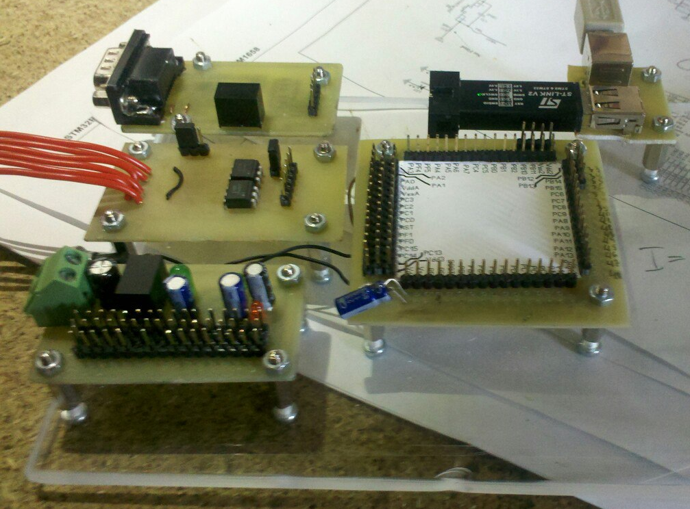
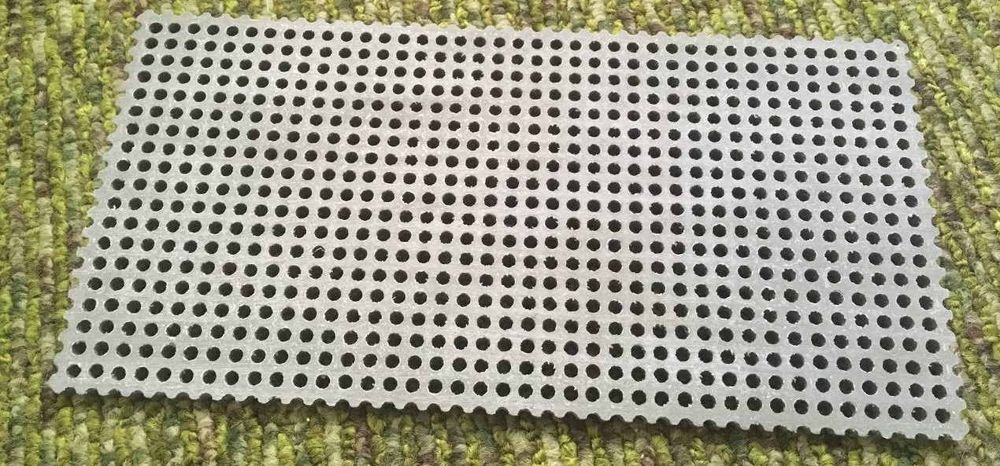
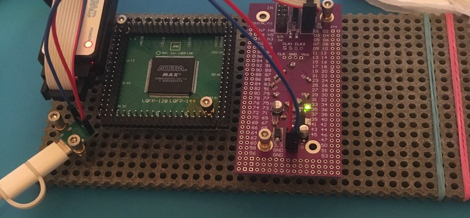
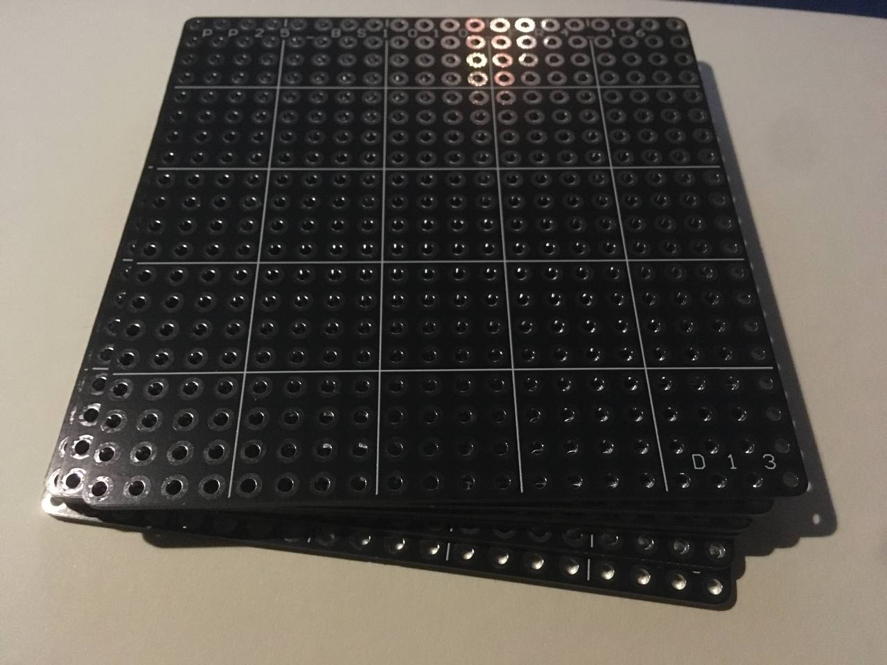
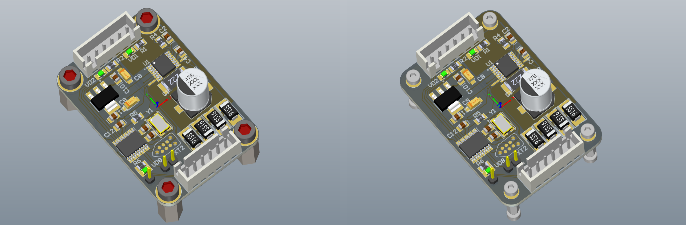
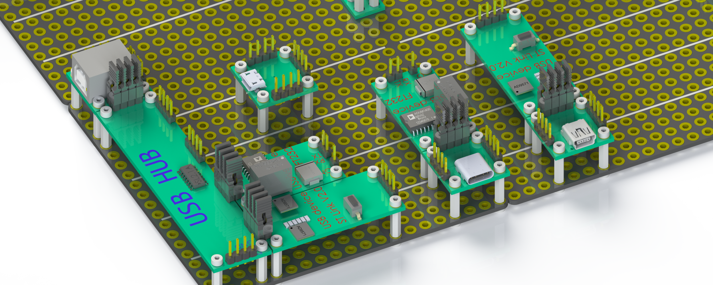
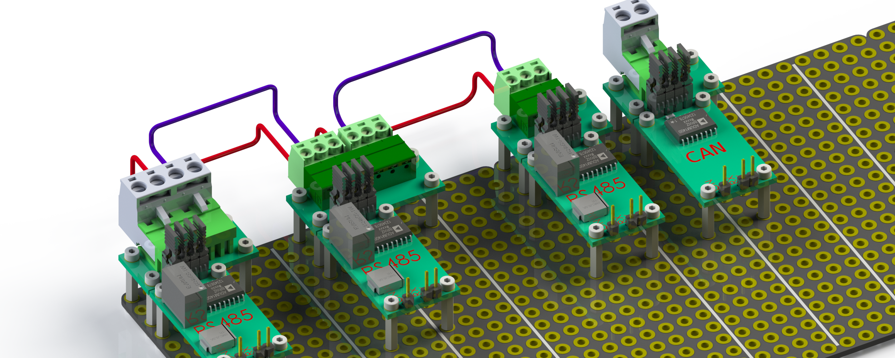
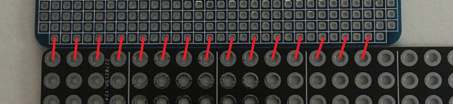
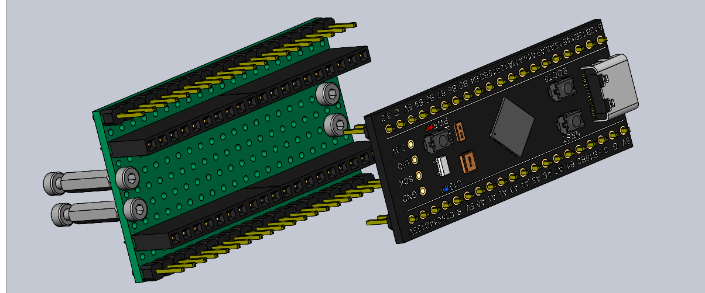
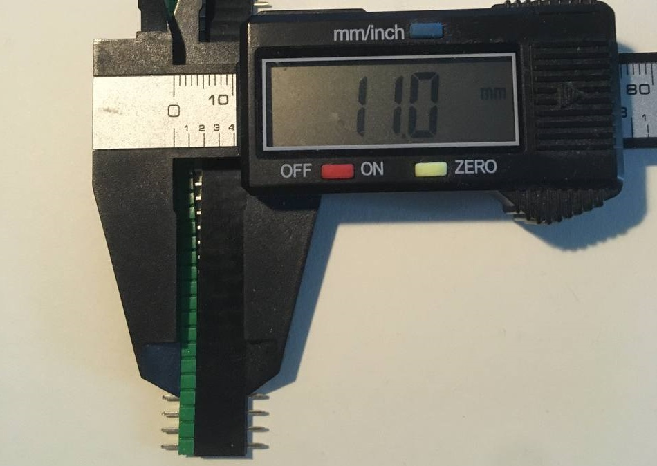

## ㅤPrehistory
ㅤAbout ten years ago, I worked at a company producing industrial equipment. In control cabinets, I always tried to use purchased products. But there came a time when I couldn’t find a device on the automation market that solved the task for a reasonable price. The closest solution looked like using a microscope to hammer nails. This situation forced me to start DIY.

ㅤFor debugging the device, I assembled a prototype from several module boards mounted on plexiglass with TFF-M3x12 standoffs. It was inconvenient to assemble the prototype on the table because it needed to be mobile for transfer to the shop for debugging with the equipment. In the center was a module with STM32 and minimal circuitry, an RS485 module, and some other modules specific to industrial equipment control.
ㅤDividing into modules simplified circuit debugging; in case of errors, not the whole device was fixed. Also, if during the process it was necessary to connect a module to other microcontroller pins, it was done instantly, since the modules were connected with dupont jumpers to PLS pins. Then the circuitry and software were refined.
ㅤWhen there were no more questions about the circuitry, the final device was developed based on the prototype, PCB layout was done, and a DIN rail case was selected. Parts and PCB manufacturing were ordered. While the slow procurement department was working, software debugging continued on the prototype. By the time the components and PCBs for the final version arrived, the software debugging was complete. The device was assembled, installed on the equipment, the prototype was disassembled and put away until DIY was needed again.
ㅤGiven the previous project, where the prototype survived frequent transfers from the office to the shop and back, development continued with the same approach. Some modules from the previous project were reused, missing ones were made. During assembly, it turned out that holes were made in certain places, and to change the relative position of modules, new holes had to be drilled. So, in the new plexiglass sheet, a grid of holes with a 5 mm pitch and 3 mm diameter was made. This allowed modules to be placed in any order, since the mounting holes on the modules also had a 5 mm pitch.
ㅤSince then, several more projects have been developed with this approach over a fairly long period. Nothing new was added to the prototyping approach, since my main activity was not electronics development.

## ㅤPortable Prototyping
ㅤFrom the above history, it can be concluded that it is enough to prepare a part with an array of holes, a stock of standoffs, screws, dupont jumpers, and to use a 5 mm pitch for mounting holes in new modules — over time, you will get a certain set with which you can assemble a mechanically solid prototype.
ㅤBut in the approach described above, I saw some incompleteness. All this time, there was an obsessive idea to somehow develop this direction and share the developments, since I am sure there are those who have encountered a similar situation. Not in the need for DIY, but in assembling a portable prototype. Recently, I found time to devote to the topic of portable prototyping.

## ㅤBase
ㅤBy "base" I mean a flat part with a grid of holes on which modules are mounted. The size of the base is indicated by the number of holes on the sides and the distance between the holes. The size is indicated by a pair of two-digit numbers with leading zeros.
ㅤIn the first version, it was plexiglass with manually made holes. In a base sized 2040 (10x20 cm), you need to make 800 holes. By the end of this task, I was a bit nervous, I do not recommend repeating it. The accuracy is acceptable, but no, it’s not worth it. After some time, the opportunity arose to do laser cutting. Due to the density of the cut, the base warped from heating, had to be heated with a hair dryer and straightened. The result is much better than manual, but requires refinement and access to laser cutting and material.
ㅤThen, recently, I finally tried 3D printing. The result is acceptable, I could recommend it, but again, accessibility and cost.

  
  

## ㅤBase Made of PCB
ㅤRecently, while tidying up, I was moving printed circuit boards from the table and back, and realized that here is the solution that had been overlooked for so long. After all, those who develop electronics have experience ordering PCB manufacturing. That is, making a base out of PCB is probably easier than looking for cutting or 3D printing. This gives another plus — reducing the variety of screws for mounting, since the standoff is fastened with screws of the same length on both sides, and both sides are PCB.

  

## ㅤReducing Mounting Hole Size
ㅤRecently, I made a servo controller module, size 32x42 mm with compatible mounting holes, attached it to the base and saw how much space the screw heads take up.

  

ㅤAnd the diameter on the board is 6.5 mm, which does not help placing two holes in adjacent cells. I decided that although M3 standoffs are more common, it’s better to switch to M2. The low prevalence is compensated by the fact that you can buy 200–500 pieces in bulk once.

## ㅤButt Connections
ㅤReducing the size of the holes saves space, which is critical for small modules. It also makes it possible to mount modules butt-to-butt, even if the fastener is at the very edge of the module. This brings another possibility — connecting modules not with dupont jumpers, but with jumpers.

ㅤSuch a variant is specific and somewhat proprietary, but backward compatible, since it allows connection with the same dupont jumpers. Illustrations of possible applications for clarity.

## ㅤReconsidering the Base Grid Size

ㅤThe idea of butt-to-butt connection introduced complexity related to the mismatch between the base grid of 5 mm and the perfboard perforation of 2.54 mm.

ㅤIt means that to align the pins, you need to orient to some reference point, which brings difficulties and limitations. The base pitch of 5 mm was chosen without much justification, as a suitable round number in the metric system. There is no reason to stick to this value. I decided that the base grid should be made with a pitch of 5.08 mm, that is, 200 mil. As much as I would like to rely on the metric system, this solution has more advantages than disadvantages.

## ㅤAdvantages of the New Base Grid Size
ㅤBesides simplifying the development of butt-to-butt modules, we get the opportunity to quickly make a compatible module from a regular perfboard. Drill the holes to 2 mm, and you get compatible mounting holes. Assemble the module on the perfboard itself.

ㅤYou can also make adapters for modules with downward soldered pins, when it was originally intended to use with a breadboard.

## ㅤOn Budgeting
ㅤThere are PCB manufacturers who make boards sized 100x100 as prototypes. When I ordered the first versions of the base as boards, they were exactly 100x100. With a grid of 5.08, the size is already 101.6x101.6. This does not fit into the more budget-friendly way of getting the base, but where I ordered, this size passed as a prototype.
ㅤIf the size 101.6x101.6 is not enough, you can join two bases butt-to-butt. I think a separate connecting fastener is unnecessary in terms of budgeting, it’s enough to solder two small ones together. And those who do not chase budget can order a larger base, maybe even not the standard thickness of 1.6 but 2 mm for increased rigidity.

## ㅤMounting Screws
ㅤThere are many screws with different heads. For myself, I chose screws with a hex head. They seem most convenient for assembly. Such a screw is easier to control and does not get lost, since it can be put on a hex key without any magnets, as with screwdrivers. Yes, exactly a key. Again, in my opinion, it is better to keep a separate tool specifically for assembling prototypes. And a 1.5 mm hex key takes up almost no space compared to a screwdriver.

## ㅤBoard Standoffs

ㅤRegarding board standoffs, there is not much to say, except that their length is determined by the distance between PCBs when connecting them with a PLS comb and a mating connector. This increases their scope of application, not only for the prototyping set. As a counterpart for mounting modules, theoretically, other elements can be used, maybe even soldered onto the module board. But using solutions that increase the variety of the starter set is not part of the concept.

## ㅤTools
ㅤI think it is useful to keep a separate tool specifically for this task. Assemble only modules on the base with a screwdriver or hex key, and store together with other items of the set. A drill clamped in a collet chuck for enlarging mounting holes in perfboards, or another tool that can do this operation. Also, other small tools that you consider necessary and can afford to duplicate.

## Minimal Starter Set
- base — PCB with an array of 2 mm holes with a pitch of 5.08 mm
- board standoffs TFF-M2x11 female-female
- double the number of M2x6 screws
- hex key or screwdriver
- dupont female-female jumpers
- perfboards of suitable sizes and parts for making modules and adapters
- PLS and PBS with a pitch of 2.54
- jumpers for PLS, if you plan to use butt-to-butt modules
- tool for enlarging holes to 2 mm in perfboards (a 2 mm centering drill is good, it will immediately form a chamfer plus a manual mini drill with a collet chuck)

## ㅤBasic Principles for Further Development of the Prototyping Approach
- maximum budget-friendliness
- reducing the variety of components needed to work with the portable prototyping kit
- maximum DIY compatibility (if possible, avoiding solutions unsuitable for self-manufacturing)

## ㅤFurther Plans
- work out the terminology in more detail
- create a document with rules and terminology — an instruction or guideline
- develop modules and publish developments
- work out visual examples of real devices to demonstrate the positive properties of the approach

