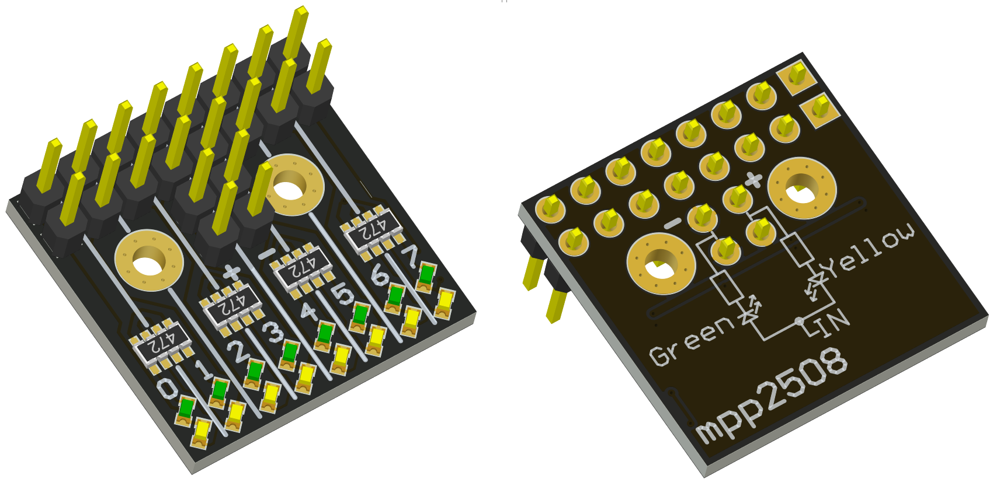
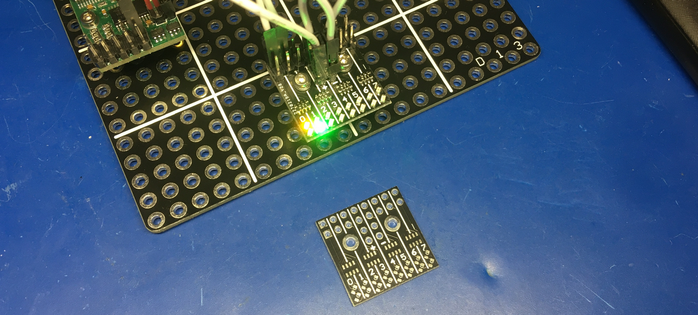

- [x] индикация высокого, низкого и высокоомного состояния

устаревший вариант, имеет недостатоки
- не может подключаться встык
- нет шунтирующих резисторов для светодиодов, из-за чего есть свечение обеих светодиодов при плавающем входе

