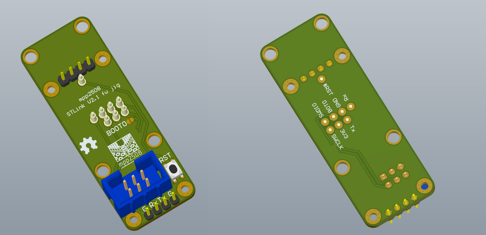

# [Адаптер для прошивки бутлоадера STLink V2.1](https://github.com/mpp2508/mpp_stlink_v2x1_fw_jig)
Позволяет прошить бутлоадер [STLink V2.1]({{site.baseurl}}/docs/m/prg_dbg/mpp_stlink_v2x1/) без подпайки проводов.
Прошивка возможна как и через SWD, так и через встроенный uart бутлоадер и утилиту [STM32 Flash loader demonstrator](https://www.st.com/en/development-tools/flasher-stm32.html#overview) .

