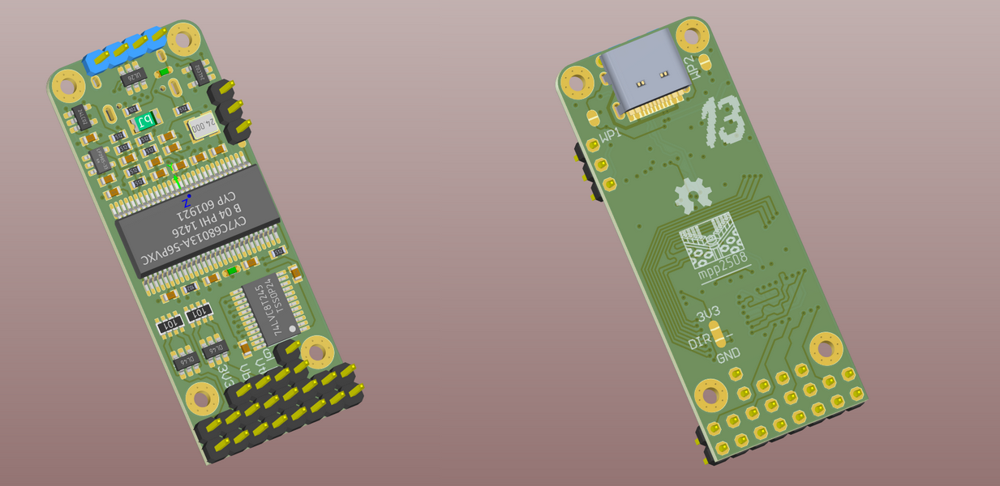

# [Логический анализатор CY7C68013A](https://github.com/mpp2508/mpp_cy7c68013a_la)
- [x] Имеет две EEPROM, что позволяет быстро переключатся между двумя конфигурациями без перепрошивки
- [x] Возможность работать с сигналами, отличными от 3,3в. 
- [x] На каждый вход два пина, позволяет подключать в разрыв сигнала без дополнительных разветвителей.

