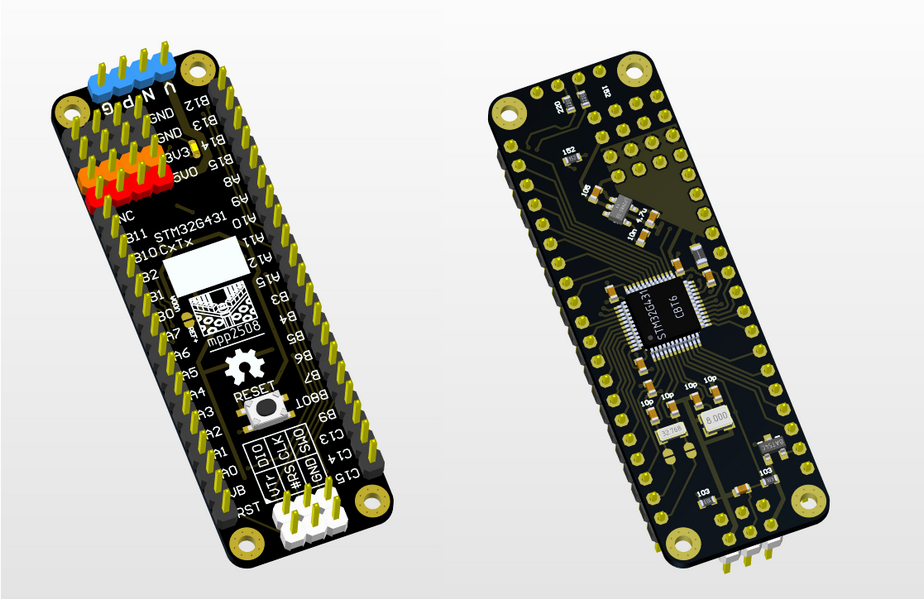
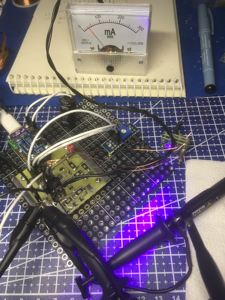
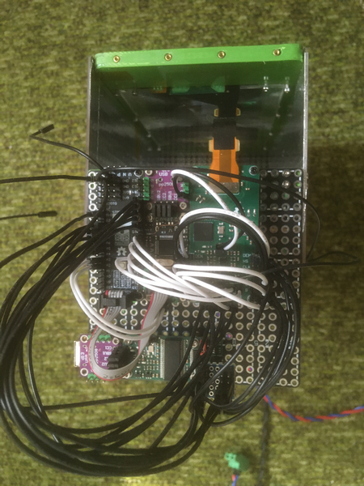

mpp2508 - modular portable prototyping

    
    
    

        
        
        

        
        
        

        
        
        

         
         
         

<!--  -->

### mpp2508 - это некоторый набор правил разработки совместимых модулей, из которых собираются монолитные прототипы электронных устройств.

### #mpp2508 - хештег для распрастранения совместимых модулей.

### mpp2508 - открытый проект, используйте правила, делайте совместимые модули, больше совместимых модулей - больше возможностей.

## Механическая монолитность позволяет:

 - перемещать прототип и производить отладку в комплексе с другим оборудованием в полевых условиях.
 - быстро собирать временные устройства. Устройства, которые нужны на один-два раза,  больше навряд пригодятся. И покупка или изготовление их имеет низкую целесообразность.
 - удобно работать над несколькими проектими. Монолитные прототипы легче поочередно разворачивать на рабочем месте.

## Модули и совместимость

Разнообразие совместимых модулей увеличивает возможности. Под совместимостью подразумевается соответствие правилам. Минимальный уровень совместимости, это крепежные отвестия 2мм с шагом 5,08мм и соеденительные pls запаянные вверх. Для всего остального разнообразия модулей есть [адаптеры]({{site.baseurl}}/docs/m/adap/)  позволяющие их крепить к основе.

